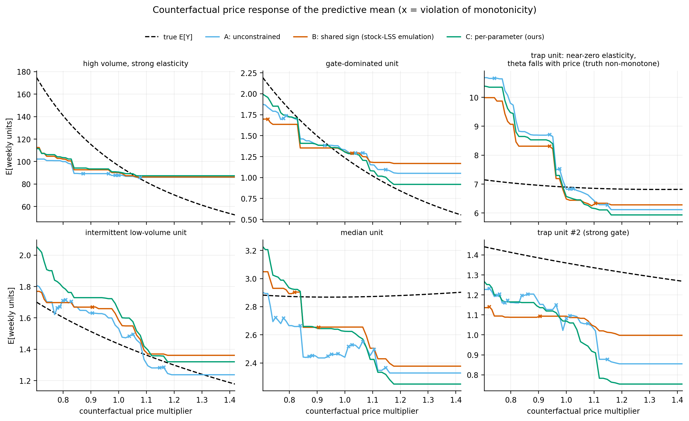
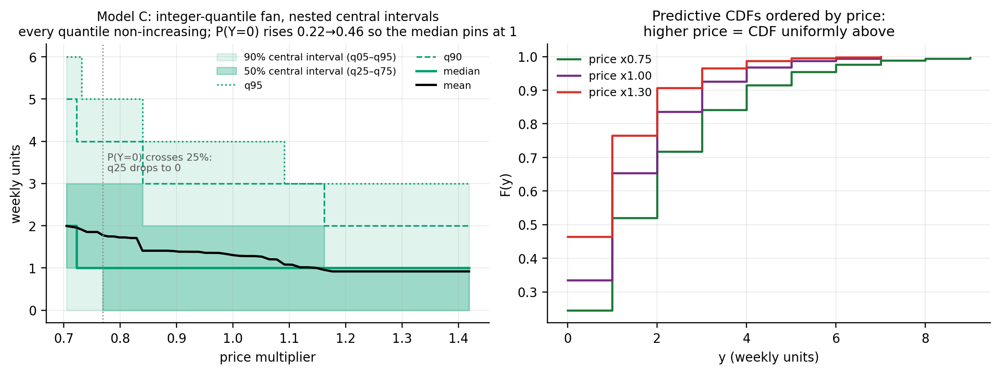
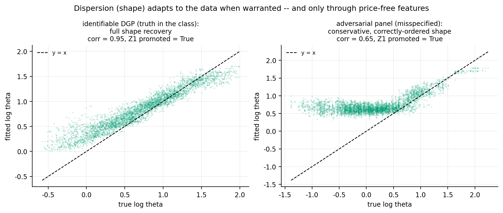
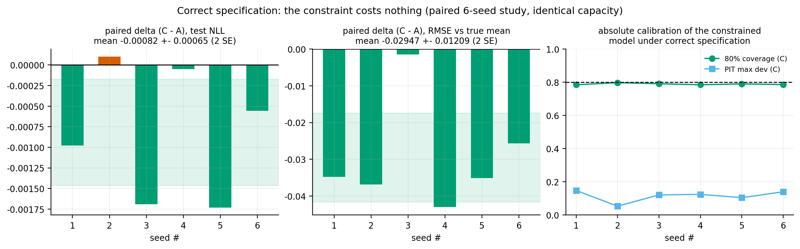

# Monotone ZANB-LSS

**Pointwise price-monotone distributional gradient boosting for zero-adjusted (hurdle) Negative
Binomial outcomes, on LightGBM — with research-grade proofs and a machine-checked verification
suite.**

This repository solves a problem that stock GAMLSS-style boosting frameworks
(LightGBMLSS / XGBoostLSS) cannot express: fit the **full conditional distribution** of an
intermittent count outcome (e.g. weekly retail/pharmacy demand) while **guaranteeing — for every
scored instance, with no post-processing — that the predictive mean and every quantile are
non-increasing in price**, and while the degree of zero inflation and the shape of the positive
part keep varying freely with the regressors.

```
Y | x ~ ZANB(pi(x), mu(x), theta(x))        # hurdle NB2

P(Y=0) = pi                                  # gate: probability of a zero
P(Y=k) = (1-pi) * NB2(k; mu, th) / (1 - NB2(0; mu, th)),  k >= 1
E[Y]   = (1-pi) * mu / (1 - p0(mu, th))
```

## Why stock LSS cannot do this

GBMLSS frameworks train **one multiclass booster** (`num_class = n_dist_param`, one tree per
distributional parameter per iteration). LightGBM has a **single global** `monotone_constraints`
vector, applied identically to every output's trees. But monotone-in-price ZANB needs three
*different* treatments of the price feature:

| parameter | required treatment | why |
|---|---|---|
| gate `pi` (P(zero)) | constraint **+1** | zeros become more likely as price rises |
| location `log mu` | constraint **−1** | latent demand falls as price rises |
| dispersion `log theta` | **excluded** from price features | the truncated mean `mu/(1-p0)` is *decreasing* in `theta` (Lemma 3): a dispersion that falls with price pushes the conditional mean *up* with price through zero-truncation. "Unconstrained" leaves the hole open; a shared `−1` invites it |

One global sign vector cannot express `(+1, −1, excluded)` — demonstrated executably: a 2-output
`num_class` booster with targets of *opposite* slopes under `monotone_constraints=[-1]` returns
**both** outputs non-increasing (max positive step exactly `0.0`); the +slope target is crushed
(RMSE 1.73 vs 0.004).

## The construction

The hurdle likelihood **separates**: `l = Bernoulli(z=1{y=0}; pi) + 1{y>0} * l_ZTNB(y; mu, th)`.
So the exact joint MLE decomposes into:

1. **Gate booster** — a stock LightGBM `binary` model on `1{y=0}`, monotone **+1** on price.
2. **ZTNB pair** — two coupled boosters on the positive rows, trained in two phases:
   - **Z0**: location boosting with `theta` held as a *global scalar*, re-profiled by 1-D Newton
     after every tree (never the pooled unconditional MLE — that degenerates to the
     `theta -> 0` ridge where all NB2 gradients die);
   - **Z1**: cyclic per-parameter Newton steps (gamboostLSS-RS style) from the calibrated Z0 state,
     with the `theta` booster **kept only if it beats Z0 on validation NLL** (quality can only
     move up). `mu` is monotone **−1** on price; the `theta` booster's feature set **excludes**
     price.

All ZTNB derivatives are **analytic** (scipy; validated against finite differences to ≤ 1e-7 for
gradients and ≤ 4e-9 for hessians, with the score identity asserted within Monte-Carlo error), so
no torch/autograd is needed at production scale. Means, CDFs, quantiles and randomized-PIT are
closed-form.

**Guarantee** (proofs in [THEORY.md](THEORY.md)): under the explicit assumptions A0–A4, for every
input — observed, counterfactual, or out-of-support — the predictive distribution at a higher price
is first-order stochastically dominated. Hence the mean *and every quantile* are non-increasing in
price, at every boosting iteration, regardless of data, seeds, gradient stabilisation or
convergence. The constraint is structural (it lives in the hypothesis class), which is exactly why
a penalised ("constrained likelihood") variant cannot replace it: trees are piecewise constant, so
monotonicity penalties have no usable gradient and bind only where they are evaluated, while
violations live at split thresholds that move every iteration.

Two non-obvious hazards were **discovered by the verification suite** and are part of the contract:

- **A1b (missing values):** NaN inside a *constrained* feature silently breaks LightGBM's monotone
  enforcement — even on numeric-only sweeps, and even on *other* constrained features
  (reproduced at O(1e-2); exact 0.0 once NaN is removed). Contract: constrained features are
  NaN-free; missingness is encoded as a neutral value + an unconstrained, intervention-static
  indicator (certified monotone).
- **Start values:** pooled unconditional `(mu, theta)` MLE start values degenerate when unit means
  span orders of magnitude (`theta -> 0` ridge: gradients die, the dispersion booster anti-learns
  the location residual). The Z0 profile-Newton start fixed dispersion recovery from
  `corr(log θ̂, log θ*) = −0.91` to `+0.65` on the adversarial panel.

## Results

**Adversarial panel** (`experiment/run_experiment.py`): 40 products × 15 pharmacies × 130 weeks;
unit means spanning ~4 orders of magnitude; promo-driven price paths; heterogeneous elasticities;
gate rising and dispersion falling in price — so the *true* mean is locally **non-monotone** for
"trap" products (8.1% of sweeps): the inductive bias must hold even against the likelihood.
Three models, identical capacity: **A** unconstrained, **B** one shared `−1` vector (what stock
LightGBMLSS + `monotone_constraints` would do), **C** per-parameter (ours).

| | A: unconstrained | B: shared sign | **C: per-parameter (ours)** |
|---|---|---|---|
| sweeps with any mean increase in price (1200 units × 57-pt grid) | 99.9% | 87.3%* | **0.0% — exact** |
| out-of-support sweeps (±0.6) | 96.3% | 72.4%* | **0.0% — exact** |
| quantile (q10–q99) / full-CDF dominance violations | — | — | **0** |
| test NLL (oracle 1.9304) | 1.9639 | 1.9674 | **1.9638** |
| RMSE / RMSLE of Ê vs true mean | 2.532 / 0.1467 | 2.285 / 0.1480 | **2.269 / 0.1451** |
| recovery corr: gate / location / dispersion | 0.967 / 0.966 / 0.631 | 0.950 / 0.961 / 0.654 | **0.968 / 0.961 / 0.647** |
| product-level elasticity corr with truth | 0.545 | 0.324 | 0.438 |

\* B's violation rate is a hyperparameter lottery. Its gate — constrained `−1` against a zero rate
that truly *rises* with price — never splits on price under any setting tried (split census), so
the price→occurrence channel is always deleted and the zero rate always miscalibrated. What swings
between 87% and 0% violations is the *theta* booster: when it picks up the price–dispersion signal,
zero-truncation pushes the conditional mean up with price; when it misses it, B's positive part
coincides with C's and B is monotone only by accident. Either failure mode, no guarantee.

The headline: **the guarantee is free.** C ties/beats the unconstrained model on NLL and beats it
on oracle-mean RMSE/RMSLE — correctly-signed constraints act as regularisation, not a tax.




## Verification suite

[`experiment/verify_theory.py`](experiment/verify_theory.py) is the executable form of
[THEORY.md](THEORY.md) — it exits non-zero if any gate fails and writes
`experiment/verification_report.json`:

- **V0** analytic score/information vs finite differences (≤ 1e-7 / ≤ 4e-9); score identity at the truth.
- **V1** distribution lemmas on dense grids over the full raw-score clip envelope (truncated-mean
  monotonicity, the `w(u) < 0` dispersion inequality, ZTNB FOSD, ZANB CDF ordering).
- **V2** adversarial certification of LightGBM's constraint enforcement: 3 methods × capacities ×
  NaN contamination × native/custom objectives, sweeps to ±1e9 — max positive step **0.0**; plus
  the `num_class` single-vector demonstration.
- **V3** per-instance audit of the fitted models on an 89-point grid incl. out-of-support: mean and
  all three parameter channels on **every** test instance (7,200), quantiles q10–q99 on 1,500 and
  full-CDF dominance on 400 randomly-drawn instances — max violating step **exactly 0.0**
  everywhere; plus a price-split census (informative monotone, no channel deletion).
- **V4a** flexibility/no-collapse on an *identifiable* DGP: the constrained class recovers
  pi/mu/theta surfaces (corr 0.97 / 0.99 / **0.95**), theta exactly price-flat.
- **V4b** misspecified-panel conditional calibration: constrained *beats* unconstrained
  (variance log-log slope 1.009, PIT-by-tier 0.164 vs 0.219); oracle-location attribution of the
  dispersion-absorbs-misfit artefact.
- **V5** the A1b missing-value hazard reproduction + safe-encoding certification.
- **V6** *no power loss under correct specification*: paired 6-seed study (constrained vs
  unconstrained, identical capacity) — the constrained model comes out **strictly better**:
  ΔNLL = −0.00082 ± 0.00032 (SE), ΔRMSE-vs-true-mean = −0.029 ± 0.006, parameter-recovery deltas
  all ≥ 0; **absolute calibration achieved** (PIT max deviation 0.115, 80%-coverage 0.789),
  Z1 dispersion booster promoted on 6/6 seeds.

**All 28 hard gates pass** (plus 4 recorded diagnostics; `experiment/verification_report.json`).
The suite also renders the two headline evidence figures: `f8_shape_recovery.png` (dispersion
adapts — fully on the identifiable DGP, conservatively and correctly ordered on the misspecified
panel) and `f9_no_power_loss.png` (the paired study with absolute-calibration panels).




## Reproduce

```bash
pip install -r requirements.txt
python experiment/run_experiment.py     # panel experiment: figures/ + results.json   (~2 min)
python experiment/verify_theory.py      # all verification gates                      (~15 min)
```

## Layout

```
THEORY.md                      formal statement, proofs, failure atlas, assumption-to-gate map
experiment/zanb_lss.py         ZANB math (analytic derivatives), two-phase trainer, gate booster
experiment/run_experiment.py   adversarial panel, models A/B/C, audits, figures
experiment/verify_theory.py    verification suite (exits non-zero on any gate failure)
experiment/results.json        experiment metrics
experiment/verification_report.json
experiment/figures/            f1..f7 (experiment), f8..f9 (verification suite)
experiment/diagnose_theta.py   forensic script that isolated the degenerate-start hazard
experiment/audit_quantiles.py  ad-hoc audit: closed-form quantiles vs brute-force pmf inversion
```

## References

- Rigby & Stasinopoulos (2005), *GAMLSS*, JRSS-C — the RS cyclic-update algorithm our phase 2 mirrors.
- Cameron & Trivedi (2013), *Regression Analysis of Count Data*, 2nd ed. — NB2 mean–dispersion
  parameterisation and profile estimation of the dispersion (our Z0 phase is a boosted analogue).
- Duan et al. (2020), *NGBoost*, ICML — per-parameter base learners.
- März (2019), *XGBoostLSS*; März & Kneib (2022), *Distributional Gradient Boosting Machines* —
  the `num_class` mechanics this work forks.
- Mayr et al. (2012); Thomas et al. (2018) — gamboostLSS cyclic updates and stabilisation heritage.
- Shaked & Shanthikumar (2007), *Stochastic Orders* — MLR ⇒ FOSD (Thm 1.C.1), used by Lemma 2'.
- `StatMixedML/LightGBMLSS` — the reference implementation studied (and the `zero_inflated.py`,
  `model.py` behaviours cited in the strategy doc).

MIT License.
